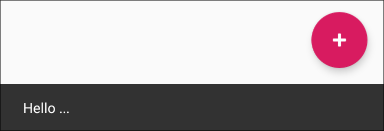
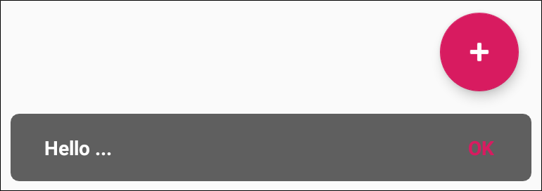
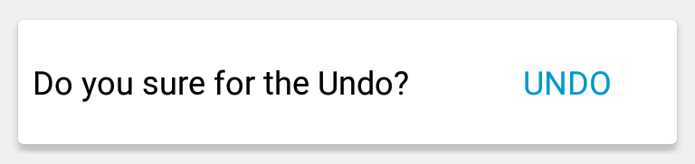
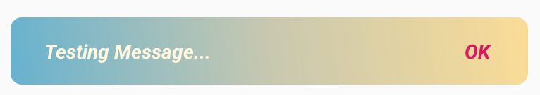

# Android Custom Snackbar

[](https://jitpack.io/#kishandonga/custom-snackbar)

Android custom snackbar is derived from the android default snackbar control  
- Use it in Activity or Fragment
- Change the background and text color easily
- Custom view applies in the snackbar control
- Typeface applies easily on text
- Corner radius and Padding applies
- Androidx supported
- More to find out yourself

## Installation
Gradle:

```groovy
repositories {
    maven { url 'https://jitpack.io' }
}

dependencies {
    implementation 'com.github.kishandonga:custom-snackbar:1.1'
}

//required lib modules
implementation 'androidx.appcompat:appcompat:1.1.0-alpha02'
implementation 'com.google.android.material:material:1.1.0-alpha03'
```

## Screenshots

<div>
Custom snackbar same as Default Control of the android Snackbar<br/> 
<br/><br/> 
Make background semi-transparent and add corner radius for the better look<br/> 
<br/><br/>  
Custom view according to your requirements<br/> 
<br/><br/>  
Apply gradient in the snackbar background<br/> 
<br/><br/> 
</div>

## Examples

#### Refer This Sample Code
For, the more infromation refer this sample code [here](app/src/main/java/com/example/custom_snackbar/ui/)

#### With Coordinator Layout
Passing the activity context and coordinator layout as view in the custom snackbar constractor as shown below
```kotlin
CustomSnackbar(this, **<root_view>**).show {...}
```

#### Without Coordinator Layout
Only pass the activity context in the custom snackbar constractor as shown below
```kotlin
CustomSnackbar(this).show {...}
``` 
Kotlin
```kotlin
CustomSnackbar(this, root).show {
    textTypeface(BOLD | BOLD_ITALIC | ITALIC | NORMAL | CUSTOM)
    actionTypeface(BOLD | BOLD_ITALIC | ITALIC | NORMAL | CUSTOM)
    textColor(...)
    backgroundColor(...)
    border(..., ...)
    cornerRadius(...)
    padding(...)
    duration(LENGTH_INDEFINITE | LENGTH_LONG | LENGTH_SHORT)
    actionTextColor(...)
    message(...)
    withAction(android.R.string.ok) {
        it.dismiss()
    }
}
```
Java
```java
CustomSnackbar sb = new CustomSnackbar(MainActivity.this);
sb.message("Testing Message...");
sb.padding(15);
sb.cornerRadius(15);
sb.duration(Snackbar.LENGTH_LONG);
sb.withAction(android.R.string.ok, new Function1<Snackbar, Unit>() {
    @Override
    public Unit invoke(Snackbar snackbar) {
        snackbar.dismiss();
        return null;
    }
});
sb.show();
```

#### Custom View

Kotlin
```kotlin
CustomSnackbar(this).show {
    customView(R.layout.snack_layout)
    padding(...)
    duration(LENGTH_INDEFINITE | LENGTH_LONG | LENGTH_SHORT)
    withCustomView {
        it.findViewById<View>(R.id.btnUndo).setOnClickListener {
            dismiss()
        }
    }
}
```
Java
```java
final CustomSnackbar sb = new CustomSnackbar(MainActivity.this);
sb.customView(R.layout.snack_layout);
sb.duration(Snackbar.LENGTH_INDEFINITE);
sb.withCustomView(new Function1<View, Unit>() {
    @Override
    public Unit invoke(View view) {
        view.findViewById(R.id.btnUndo).setOnClickListener(new View.OnClickListener() {
            @Override
            public void onClick(View view) {
                sb.dismiss();
            }
        });
        return null;
    }
});
sb.show();

// OR Use Like This Way

// View v = sb.getView();
// if(v != null){
//    v.findViewById(R.id.btnUndo).setOnClickListener(new View.OnClickListener() {
//        @Override
//        public void onClick(View view) {
//            sb.dismiss();
//        }
//    });
// }
```

#### With Drawable

Kotlin
```kotlin
CustomSnackbar(this).show {
    drawableRes(R.drawable.ic_gradient)
    ...
}
```
Java
```java
CustomSnackbar sb = new CustomSnackbar(MainActivity.this);
sb.drawableRes(R.drawable.ic_gradient);
sb.message("Test Message...");
sb.padding(15);
sb.duration(Snackbar.LENGTH_LONG);
sb.show();
```

## API Documents

|Function             |Parameter            |Description          |
|:-------------------:|:-------------------:|:-------------------:|
|actionTextColor      | Integer Color Value | Change the action button text color, default value is colorAccent
|actionTextColorRes   | Color Resource      | Refer actionTextColor function description
|textColor            | Integer Color Value | Change the message text color, default value is white color
|textColorRes         | Color Resource      | Refer textColor function description
|backgroundColor      | Integer Color Value | Change the background color of the snackbar, default value is same as snackbar background also you can't make it transparent
|backgroundColorRes   | Color Resource      | Refer backgroundColor function description
|cornerRadius	      | Float Value         | Apply corner radius all the side (Left, Top, Right, Bottom), default value is 0
|cornerRadiusRes      | Dimension Resource  | Refer cornerRadius function description
|border		          | Width as Integer and Integer Color Value   | Apply border width and color around the snackbar, default value of the width is 0 and color is transparent
|borderRes            | Width as Dimension Resource and Color Resource  | Refer border function description
|customView           | View or Layout Resource  | set the your customized view as snackbar, default value is null also when you apply custom view then other api are not in use as shown in the example code
|message              | String  | set the message as string and default value is empty string
|messageRes           | String Resource  | Refer message function description
|duration             | Integer Value  | set the time duration default value is Snackbar.LENGTH_SHORT
|padding              | Integer Value  | apply the padding at the (Left, Right, Bottom) side, default value is 0
|paddingRes           | Dimension Resource  | Refer padding function description
|textTypeface         | Typeface  | Change the message text Typeface, default value is Typeface.NORMAL
|actionTypeface       | Typeface  | Change the action button text Typeface, default value is Typeface.NORMAL
|withAction           | String Resource or String and Snackbar as anonymous function | pass the first argument as action button name and default value is empty string, second argument as lamda function with snackbar reference
|withCustomView       | View as anonymous function  | when custom view initialze then passing here for your further use
|drawable             | GradientDrawable | set the gradient drawable as snackbar background, default value is null also when you apply drawable then background color, cornerRadius, border width and color api are not in use as shown in the example code
|drawableRes          | Drawable Resource| Refer drawable function description
|show	              | Void Or Koltin DSL | Show the snackbar view
|dismiss              | Void Or Unit | Dismiss the snackbar view
|getView              | Void and return View? | Same as withCustomView but it will return null value too


### About me

Kishan Donga ([@ikishan92](https://twitter.com/ikishan92))  
I am mobility developer.


